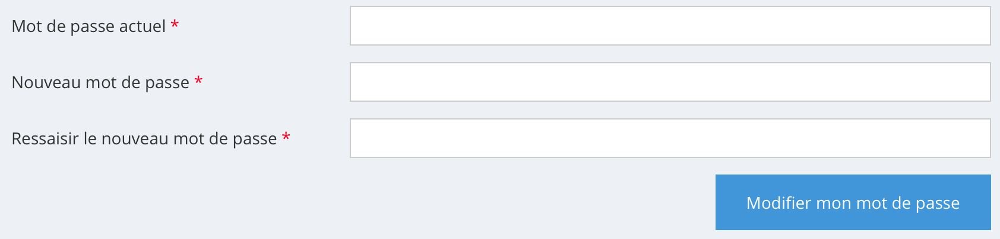

# Gestion des formulaires

## Description
Les fichiers ```.form.json``` permettent la gestion des formulaires HTML.

## Prérequis
* La compréhension des routes est requise.
* La compréhension des vues (views) est requise.

Les fichiers de configuration des formulaires sont au format JSON (ou JSONC). Il est nécessaire de créer un fichier par formulaire et son emplacement est libre dans le dossier ```Sources```.

# Exemple d'utilisation d'un formulaire web
Voici un exemple de fichier de configuration JSON permettant à un utilisateur de modifier son mot de passe.

Extrait d'une configuration d'une route :
```jsonc
// Nom du fichier :  WebApp/Sources/www/user/route.jsonc
"userParametre": {                                   // Nom de la route.
    "parents": [
        "parentsLayoutConnected"                     // Layout parent.
    ],
    "route": {
        "path": "/lang/utilisateur-parametre.html"   // URL de la route.
    },
    "titre": "Gestion de vos paramètres",            // Contenu de la balise title du HTML.
    "viewPath": [
        "user/view/parametre.html"                   // Emplacement du fichier HTML.
    ],
    "methode": [
        "wpTmUserParametre"                          // La méthode qui est exécutée par 4D.
    ]
}
```
Configuration du formulaire :
```jsonc
// Nom du fichier :  WebApp/Sources/www/user/form/parametre.form.jsonc
{
    "lib": "formUserParametre",                      // Nom du formulaire.
    "class": "m-t",                                  // Class que l'on insère dans la balise <form>.
    "action": "userParametre",                       // Route (URL) de validation du formulaire.
    "method": "POST",                                // Méthode de transfert des données du formulaire.
    "input": [                                       // Détail des entrées du formulaire.
        {
            "lib": "upMotDePasseActuel",             // Nom de l'input du formulaire.
            "label": "Mot de passe actuel",          // Label, indication sur le nom du champ.
            "type": "password",                      // Type d'input HTML.
            "colLabel": 4,                           // Largeur du label (cf. Bootstrap : row - col).
            "required": true                         // Indique que ce champ est obligatoire.
        },
        {
            "lib": "upMotDePasseNouveau",
            "label": "Nouveau mot de passe",
            "type": "password",
            "colLabel": 4,
            "required": true
        },
        {
            "lib": "upMotDePasseConfirmation",
            "label": "Ressaisir le nouveau mot de passe",
            "type": "password",
            "colLabel": 4,
            "required": true
        },
        {
            "lib": "token"                           // Le token permet de valider l'authenticité de la demande.
        },
        {
            "lib": "upSubmit",                       // Configuration du bouton submit.
            "type": "submit",
            "class": "btn btn-large",                // Class qui est intégré dans le HTML de l'input.
            "divClassSubmit": "text-right",          // Class parent qui est intégré dans le HTML.
            "value": "Modifier mon mot de passe"     // Texte affiché dans le bouton de validation.
        }
    ]
}
```

Code à insérer dans la view (page HTML) :
```html
// On remarquera que l'insertion de balise 4D est faite sous forme de commentaire HTML.

<form <!--#4DSCRIPT/cwFormInit/formUserParametre-->>
    <!--#4DSCRIPT/cwInputHtml/upMotDePasseActuel-->
    <!--#4DSCRIPT/cwInputHtml/upMotDePasseNouveau-->
    <!--#4DSCRIPT/cwInputHtml/upMotDePasseConfirmation-->
    <!--#4DSCRIPT/cwInputHtml/token-->
    <!--#4DSCRIPT/cwInputHtml/upSubmit-->
</form>
```

Voici le rendu HTML généré par le composant :
```html
<!-- On retrouve la balise FORM avec les éléments indiqués dans le fichier de configuration, la route à également été calculée pour l'action. -->
<form id="formUserParametre" class="m-t" method="POST" action="/fr/utilisateur-parametre.html">

    <!-- Génération du 1er input -->
    <div class="form-group row">
        <!-- On remarquera ici l'indication col-sm-4 issue également du fichier de configuration. -->
        <label class="col-sm-4 col-form-label" for="upMotDePasseActuel">
            <!-- On retrouve ici l'indication du label. -->
            Mot de passe actuel
            <!-- L'indication textuelle requiet est générée automatiquement. -->
            <span class="required">*</span> 
        </label>
        <!-- L'indication col-sm-8 est déduite par le composant : 12 colonnes initiales moins les 4 du label. -->
        <div class="col-sm-8">
            <!-- On retrouve la balise input qui reprend les éléments indiqués dans le fichier de configuration. -->
            <input type="password" id="upMotDePasseActuel" name="upMotDePasseActuel" class="form-control rounded-0 " placeholder="" value="" required="">
        </div>
    </div>

    <div class="form-group row">
        <label class="col-sm-4 col-form-label" for="upMotDePasseNouveau">
            Nouveau mot de passe
            <span class="required">*</span> 
        </label>
        <div class="col-sm-8">
            <input type="password" id="upMotDePasseNouveau" name="upMotDePasseNouveau" class="form-control rounded-0 " placeholder="" value="" required="">
        </div>
    </div>

    <div class="form-group row">
        <label class="col-sm-4 col-form-label" for="upMotDePasseConfirmation">
            Ressaisir le nouveau mot de passe
            <span class="required">*</span> 
        </label>
        <div class="col-sm-8">
            <input type="password" id="upMotDePasseConfirmation" name="upMotDePasseConfirmation" class="form-control rounded-0 " placeholder="" value="" required="">
        </div>
    </div>
    <!-- On retrouve ici le token qui est généré automatiquement. -->
    <input type="hidden" name="token" id="token" value="FD4D4BFA25AB450EBA7D813BDA4C1D16">

    <div class="form-group">
        <input type="hidden" name="upSubmit" value="">    
        <div class="text-right">
            <button type="submit" id="upSubmit" name="upSubmit" class="btn btn-large u-btn-blue rounded-0 g-py-12 g-px-25">
                Modifier mon mot de passe
            </button>
        </div>
    </div>
</form>
```

Rendu visuel dans un navigateur :



Voici maintenant le traitement qui peut être réalisé dans la méthode 4D de la route du formulaire : ```wpTmUserParametre```

```4d
C_OBJECT($contactAcces_o;$societe_o)

If (cwFormControl(->visiteur_o;"formUserParametre")="ok")
    
    // On vérifie si le mot de passe actuel est valide.
    
    // On retrouve la fiche de la personne.
    $contactAcces_o:=ds.ContactAcces.query("PKU IS :1";visiteur_o.ContactAccesPKU).first()
    
    If ($contactAcces_o=Null)
        visiteur_o.notificationError:="impossible de retrouver la fiche de la personne."
    End if 
    
    If (visiteur_o.notificationError="")
        If (Not(Verify password hash(visiteur_o.dataForm.motDePasseActuel;$contactAcces_o.HashPassword)))
            visiteur_o.notificationError:="La saisie du mot de passe actuel n'est pas valide."
            OB REMOVE(visiteur_o;"upMotDePasseActuel")
        End if 
    End if 
    
    // On a retrouvé la fiche du contact, test du nouveau MDP.
    If (visiteur_o.notificationError="") & (visiteur_o.dataForm.motDePasseNouveau#visiteur_o.dataForm.motDePasseConfirmation)
        visiteur_o.notificationError:="Le mot de passe saisi est différent de la confirmation."
    End if 
    
    If (visiteur_o.notificationError="") & (Num(visiteur_o.dataForm.motDePasseNouveau)=0)
        visiteur_o.notificationError:="Le nouveau mot de passe doit contenir au moins 1 chiffre"
    End if 
    
    If (visiteur_o.notificationError="") & (Not(Match regex("^(.*)[a-zA-Z]+(.*)$";visiteur_o.dataForm.motDePasseNouveau)))
        visiteur_o.notificationError:="Le nouveau mot de passe doit contenir au moins 1 lettre."
    End if 
    
    If (visiteur_o.notificationError="") & (Length(visiteur_o.dataForm.motDePasseNouveau)<<>webConfig_o.motDePasse.nombreDeCaracteres)
        visiteur_o.notificationError:="Le nouveau mot de passe doit contenir au moins "+String(<>webConfig_o.motDePasse.nombreDeCaracteres)+" caractéres."
    End if 
    
    // Différent des 2 derniers mots de passe.
    If (visiteur_o.notificationError="")
        If ($contactAcces_o.HashPassword#"")
            If (Verify password hash(visiteur_o.dataForm.motDePasseNouveau;$contactAcces_o.HashPassword))
                visiteur_o.notificationError:="Le nouveau mot de passe doit être différent du dernier mot de passe."
            End if 
        End if 
    End if 
    
    If (visiteur_o.notificationError="")
        // tous les contrôles sont passés... On prend en compte la modification du mot de passe.
        //$contactAcces_o.HashPasswordOld:=$contactAcces_o.HashPassword
        $contactAcces_o.HashPassword:=weboHashMotDePasse(visiteur_o.dataForm.motDePasseNouveau)
        $contactAcces_o.DernierChangementPass:=Current date
        $contactAcces_o.save()
        
        // Pour des raisons de sécurité on supprime les variables sur le mot de passe.
        OB REMOVE(visiteur_o;"upMotDePasseActuel")
        OB REMOVE(visiteur_o;"upMotDePasseNouveau")
        OB REMOVE(visiteur_o;"upMotDePasseConfirmation")
        
        visiteur_o.notificationSuccess:="Votre nouveau mot de passe est actif."
        
    Else 
        
        // Si il y a une erreur on vide l'input du nouveau mot de passe.
        OB REMOVE(visiteur_o;"upMotDePasseNouveau")
        OB REMOVE(visiteur_o;"upMotDePasseConfirmation")
    End if 
    
End if 
```

# Configuration des différents types d'"input"

Lors de la configuration d'un formulaire, il faut renseigner la collection ```input``` permettant de définir le comportement et l'apparence des entrées HTML.

Dans sa forme la plus basique, une entrée du formulaire aura la forme suivante :

```json

{
    "lib": "upVariable1",
    "type": "text",
    "label": "C'est la variable 1",
    "colLabel": 4
},

```

Le ```lib``` est le nom de notre variable. Généralement, on définit les premières lettres du lib de chaque input par les initiales de notre formulaire. (ici formUserParametre donc up). 

Le ```label``` est le texte qui s'affiche pour renseigner sur la nature des données à saisir dans l'input.

Le ```collabel``` organise l'espace entre le label et l'input HTML. C'est un entier compris entre 0 et 12.

Enfin, le ```type``` définit le type de variable. Une zone de texte, un menu déroulant, une case à cocher ou encore un élément caché.
Voici un tableau regroupant les différentes valeurs que peut prendre ```type``` :

| Nom de la propriété | Élément nécessaire dans input | Élément facultatif dans input                          | Commentaire |
| ------------------- | ------------------------------| ------------------------------------------------------ | ----------- |
| text                |                               | append, label, collabel, class, clientDisabled, append | Input de type texte|
| textarea            |                               | label, collabel, clientDisabled, class                 | Input de type texte multi-lignes.<br> L'ajout de la class ``` "class": "4dStyledText"``` permet de renvoyer un text multistyle sous 4D accessible depuis ```visiteur.dataFormTyping```. |
| password            |                               | append, label, collabel, class, clientDisabled, append | Input de type mot de passe|
| select              | selection                     | label, collabel, clientDisabled                        | Input de type menu déroulant |
| checkbox            |                               | label, collabel, clientDisabled                        | Input de type case à cocher |
| radio               | selection                     | label, collabel, clientDisabled, colRadio              | Input de type es boutons radio|
| hidden              |                               |                                                        | Input de type invisible|
| file                |                               | contentType                                            | Input de type envoi de document|
| toggle              |                               |                                                        | Input de type interrupteur, c'est un dérivé des checkbox|
| submit              |                               | divClassSubmit, blobSize                               | Input de type validation du formulaire|


Pour résumer les différents éléments que l'on peut trouver dans l'input, nous avons :

| Nom de la propriété | Type    | Valeur par défaut | Commentaire |
| ------------------- | ------- | ----------------- | ----------- |
| lib                 | texte   | ""                | Le nom de la variable |
| type                | texte   | ""                | Définis le type de notre variable (text, textarea, select, etc.), voir tableau ci-dessus |
| label               | texte   | ""                | Texte qui s'affiche avec notre variable sur la page web |
| helpBlock           | texte   | ""                | Affiche un message d'aide pour renseigner le champ |
| collabel            | entier  | ""                | Organise l'espace entre le label et l'input HTML|
| class               | texte   | ""                | Rajoute des class HTML à l'input |
| clientDisabled      | boolean | false             | Définis si l'input est saisissable ou pas (false = saisissable) |
| append              | texte   | ""                | Rajoute un petit texte au bout du champ de saisie (€, m2, etc.) |
| selection           | texte   | ""                | Nécessaire lorsqu'on crée un menu déroulant ou des boutons radio (voir au-dessous) |
| format              | texte   | ""                | Type les valeurs retournées dans visiteur_o.dataFormTyping, valeur possible : bool, int, real, date|
| colRadio            | entier  | ""                | Utilisé avec un type ```radio``` cela permet d'aligner les boutons radio |
| required            | texte   | ""                | Le renseignement de l'input est obligatoire |
| placeholder         | texte   | ""                |  |
| collapse            | texte   | ""                |  |
| contentType         | entier  | ""                |  |
| divClassSubmit      | texte   | ""                | Ajout d'un class parent pour les inputs type submit. |
| dateMin             | texte   | ""                | Définis la date minimum lorsqu'on a un type date |
| dateMax             | texte   | ""                | Définis la date maximum lorsqu'on a un type date  |
| blobSize            | texte   | ""                | Taille maximum autorisé pour le transfert d'un fichier |


Dans ce cas d'input nécessitant une sélection (select ou radio), une configuration en dur peut être définie de la manière suivante :
```json
{
    "lib": "upVariable1",
    "type": "text",
    "label": "C'est la variable 1",
    "colLabel": 4
    "selection": [
        {
            "lib": "choix1",
            "value": "0"
        },
        {
            "lib": "choix2",
            "value": "1"
        }
    ]
}
```

Pour définir une valeur depuis 4D à un input HTML, il est nécessaire de le définir dans l'objet visiteur.
```4d
visiteur_o.upVariable1:="Manager"
```

## Les jetons

Pour chacun formulaire, il est préférable d'utiliser un mécanisme de jeton ```token```. En effet, celui-ci est régénéré à chaque chargement de page et a la particularité de contrôler automatiquement que le formulaire envoyé depuis le navigateur est bien issu de la dernière page générée. En cas contraire, une notification est envoyée à l'utilisateur.

```json
{
    "lib": "token"
}
```