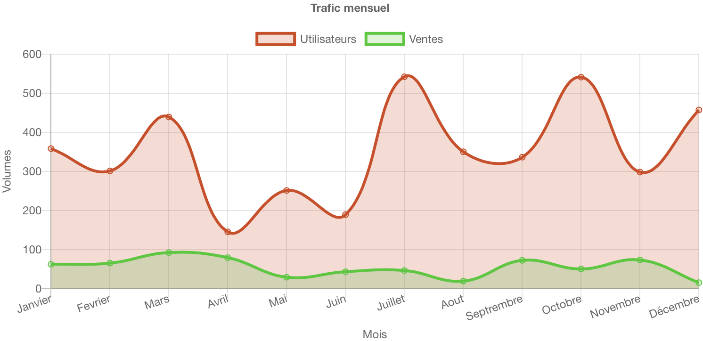

# Gestion des graphiques

## Description
Cette section décrit comment générer des graphiques HTML à partir de 4D via la librairie Chart.js.

## Prérequis
* La compréhension des routes est requise.
* La compréhension des vues (views) est requise.
* Chargement des fichiers js et css

Dans le fichier route de la page (ou la page parent) ajouter les appels CSS et JS suivant :
```json
"nomPageRoute": {
    "parents": [
        "chart" // Ce parent est initialisé dans /webApp/Sources/*SubDomain*/_cioWeb/route.jsonc
    ],
    ...
},
```

Les fichiers ```.chart.jsonc``` permettent la gestion des graphiques en HTML.
La configuration des graphiques sont au format JSON (ou JSONC). Il est nécessaire de créer un fichier par graphique et son emplacement est libre dans le dossier ```webApp/Sources```.

# Exemple d'utilisation d'un graphique
Voici un exemple de fichier de configuration JSON permettant de faire apparaitre un graphique annuel en fonction des ventes.

Configuration du formulaire :
```jsonc
// Nom du fichier :  WebApp/Sources/www/user/charts/webUser.chart.jsonc
{    
    "lib": "webUser",                            // Nom du graphique
    "type": "line",                              // Type de graphique
    "data": {
        "labels": ["Janvier", "Fevrier", "Mars", // Liste des abscisses
            "Avril", "Mai", "Juin", 
            "Juillet", "Aout", "Septrembre",
            "Octobre", "Novembre", "Décembre"]
    },
    "options": {
        "responsive": true,                      // Affichage du graphique en responsive
        "title": {
            "display": true,                     // Afficher le titre
            "text": "Trafic mensuel"             // Titre du graphique
        },
        "tooltips": {                            // Indication au survol de la souris
            "mode": "index",                     // Fusionne toutes les valeurs de la colonne
            "intersect": false
        },
        "scales": {
            "xAxes": [{
                "display": true,                 // Afficher l'axe des abscisses
                "scaleLabel": {
                    "display": true,             // Afficher le label de l'axe x
                    "labelString": "Mois"        // Label de l'axe des abscisses
                }
            }],
            "yAxes": [{
                "display": true,                // Afficher l'axe des ordonnées
                "scaleLabel": {
                    "display": true,
                    "labelString": "Volumes"    // Label de l'axe des ordonnées
                }
            }]
        }
    }
}
```

Code à insérer dans la view (page HTML) :
```html
<!-- On remarquera que l'insertion de balise 4D est faite sous forme de commentaire HTML.-->
<div class="row">
    <div class="col-12">
        <!--#4DHTML charts_o.webUser.getHtml()-->
    </div>
</div>
```

Voici le rendu HTML généré par le composant puis JavaScript:
```html
<!-- Le code HTML est généré dans un premier temps par 4D, qui est ensuite repris par le code JavaScript. -->
<div class="row">
    <div class="col-12">
        <div class="chartjs-size-monitor">
            <div class="chartjs-size-monitor-expand">
                <div class=""></div>
            </div>
            <div class="chartjs-size-monitor-shrink">
                <div class=""></div>
            </div>
        </div>
        <canvas id="webUser" width="1502" height="750" class="chartjs-render-monitor" style="display: block; height: 375px; width: 751px;"></canvas> 
    </div> 
</div>
```

Rendu visuel dans un navigateur :



Voici maintenant le traitement qui peut être réalisé dans la méthode 4D de la route du formulaire : ```wpaIndex```

```4d
var charts_o : Object  // Variable process qui contient tous les graphiques de la page web.
var $line_c : Collection
var $value_c : Collection
var $line_o : Object
var $i : Integer

// Initialisation du graphique
charts_o.webUser:=cwToolGetClass("Chart").new("webUser")

// configuration de chaque ligne
$line_c:=New collection()
$line_c.push(New object("name"; "Utilisateurs"; "color"; "orange"; "randomAX"; 500; "randomB"; 100))
$line_c.push(New object("name"; "Ventes"; "color"; "green"; "randomAX"; 100; "randomB"; 0))

$value_c:=New collection()

For each ($line_o; $line_c)
	// Valeur aléatoire pour chaque mois (fonction affine y=ax+b)
	For ($i; 1; 12)
		$value_c[$i-1]:=Random%$line_o.randomAX+$line_o.randomB
	End for 
	
	// Assigne la collection de valeur pour la ligne courante
	charts_o.webUser.dataSet($line_o.name; $value_c)
	
	// Assignation de la couleur
	charts_o.webUser.dataColor($line_o.name; $line_o.color)
End for each 
```

# En savoir plus

Pour en savoir plus sur la librairie Chart.js, vous pouvez vous rendre sur leur documentation.
https://www.chartjs.org/docs/latest/

Il existe également un certain nombre de fonction dans la class 4D Charts, la documentation est disponible ici :
https://github.com/connect-io/cioWeb.4dbase/blob/19-source/Documentation/Classes/Chart.md
